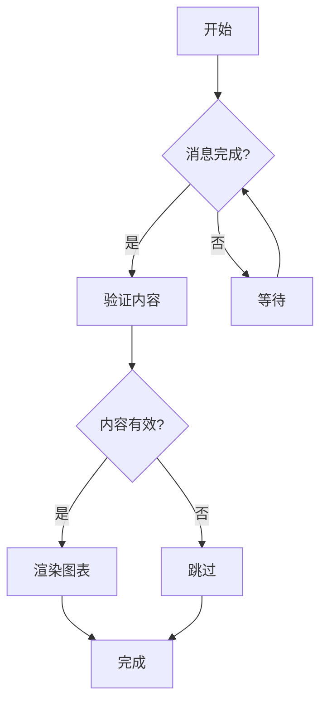
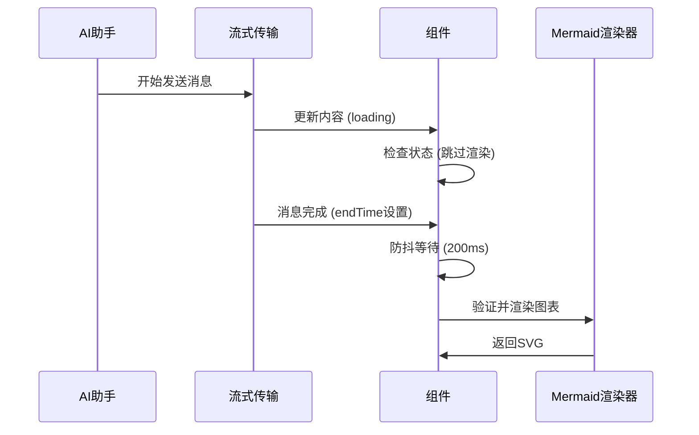

# ChatOllama开发笔记 - AI消息中的图表代码渲染

## 背景

在ChatOllama项目中，用户可以自行配置不同大模型的 `API key`，自由聊天，与 AI 互动。AI 在不同对话场景中可能会以图表的形式展示信息，提高可读性。

我们希望AI生成的消息能够自动渲染Mermaid图表。当AI回复包含```mermaid代码块时，应该自动将其转换为可视化的图表，而不是显示纯文本代码。

项目基于 `markdown-it-diagram` 插件实现完整功能，我们的图表渲染系统不仅限于Mermaid，而是一个完整的多格式图表渲染解决方案。

## 问题分析

### 初始尝试与调试过程

最初尝试使用 [markdown-it-diagram](https://github.com/ryanuo/markdown-it-diagram) 插件的官方示例代码：

```typescript
<script setup lang="ts">
import { markdownItDiagramDom } from 'markdown-it-diagram/dom'
import { onMounted } from 'vue'

onMounted(async () => {
  // if you want to use mermaid, you need to install mermaid.js
  // npm install mermaid
  // import mermaid from 'mermaid'
  mermaid.initialize({ startOnLoad: false })
  await mermaid.run()
  
  // initialize markdown-it-diagram/dom script
  await markdownItDiagramDom()
})
</script>
```

**官方示例失败的根本原因**：
主要问题不在于代码本身，而在于我对Vue.js和Nuxt.js框架的不熟悉，不确定如何在这些框架中正确集成第三方库。

### 调试突破

#### 关键发现
通过将 `mermaidModule` 暴露到 `window` 对象作为全局属性：

```typescript
// 在 composables/markdown.ts 中
import('mermaid').then(async (module) => {
  mermaidModule = module.default || module
  mermaidModule.initialize({ startOnLoad: false })
  window.mermaidModule = mermaidModule  // 关键：暴露到全局
}).catch(err => {
  console.error('Failed to load Mermaid:', err)
})
```

#### 浏览器控制台验证
在浏览器开发者工具控制台中手动调用：

```javascript
// 测试mermaid是否正确加载
console.log(window.mermaidModule)

// 手动触发渲染
await window.mermaidModule.run()
```

**结果**：手动调用 `mermaidModule.run()` 能够正常工作！这证明了：
1. Mermaid库加载正确
2. HTML结构由markdown-it-diagram正确生成
3. 问题在于渲染时机和触发方式

#### 与Claude Code协作
基于这个调试发现，将调查过程告诉Claude Code，协作完成了智能渲染时机控制。

### 技术问题分析

通过调试过程发现的核心问题：

1. **框架集成问题**：不熟悉Vue/Nuxt的生命周期和响应式系统
2. **时机控制问题**：不知道何时调用渲染函数
3. **动态内容处理**：官方示例假设静态内容，无法处理动态更新
4. **流式传输冲突**：在消息流式传输过程中会出现渲染错误
5. **内容验证缺失**：缺乏对不完整图表代码的处理

### 核心问题

通过错误日志分析发现，主要问题是**在AI消息流式传输过程中，Mermaid尝试渲染不完整的图表代码**：

```
Error rendering Mermaid diagrams:
- UnknownDiagramError: No diagram type detected matching given configuration for text
- Lexical error on line 2. Unrecognized text
```

这些错误表明Mermaid在消息还未完全接收时就尝试渲染，导致解析不完整的语法。

## 解决方案

### 1. 架构设计

基于调试发现和与Claude Code的协作，我们设计了以下架构：

```
markdown-it + markdown-it-diagram → 生成HTML结构
         ↓
useMermaidRenderer() → 智能渲染控制
         ↓
ChatMessageItem → 生命周期管理
```

**设计思路**：
1. **分离关注点**：将渲染逻辑从组件中抽离到composable
2. **全局状态管理**：通过window对象暴露mermaid实例，便于调试和控制
3. **智能时机控制**：基于消息状态和内容完整性决定渲染时机
4. **防御性编程**：多层验证确保只渲染完整有效的图表

### 2. 核心实现

#### 2.1 Markdown处理 (`composables/markdown.ts`)

```typescript
// 异步加载Mermaid模块
let mermaidModule: any = null

if (typeof window !== 'undefined') {
  import('mermaid').then(async (module) => {
    mermaidModule = module.default || module
    mermaidModule.initialize({ startOnLoad: false }) // 关键：手动控制渲染
    ;(window as any).mermaidModule = mermaidModule
  }).catch(err => {
    console.error('Failed to load Mermaid:', err)
  })
}

// Mermaid渲染器组合式函数
export function useMermaidRenderer() {
  const renderMermaidDiagrams = async (container?: HTMLElement) => {
    if (typeof window === 'undefined' || !mermaidModule) return

    try {
      const selector = '.mermaid'
      const elements = container 
        ? container.querySelectorAll(selector)
        : document.querySelectorAll(selector)

      if (elements.length > 0) {
        // 智能过滤：只渲染完整的图表
        const validElements = Array.from(elements).filter(element => {
          // 跳过已渲染的元素
          if (element.querySelector('svg')) return false

          const content = element.textContent?.trim() || ''
          
          // 跳过空内容或过短内容
          if (!content || content.length < 5) return false

          // 检测流式传输中的不完整标记
          const hasIncompleteMarkers = content.includes('```') || 
                                     content.endsWith('...') ||
                                     content.includes('▌') || // 光标指示器
                                     content.match(/\s+$/) // 末尾空白字符

          if (hasIncompleteMarkers) return false

          // 验证Mermaid图表类型
          const mermaidKeywords = [
            'graph', 'flowchart', 'sequenceDiagram', 'classDiagram', 'stateDiagram', 
            'erDiagram', 'journey', 'gantt', 'pie', 'gitgraph', 'mindmap', 
            'timeline', 'sankey', 'block', 'packet', 'architecture'
          ]

          const hasValidStart = mermaidKeywords.some(keyword => 
            content.toLowerCase().startsWith(keyword.toLowerCase())
          )

          if (!hasValidStart) return false

          // 检查基本结构（箭头、括号等）
          const hasBasicStructure = /-->|->|\||\[|\{|\(/.test(content)

          return hasBasicStructure
        })

        if (validElements.length > 0) {
          await mermaidModule.run({
            nodes: validElements
          })
        }
      }
    } catch (error) {
      console.error('Error rendering Mermaid diagrams:', error)
    }
  }

  return { renderMermaidDiagrams }
}
```

#### 2.2 组件集成 (`components/ChatMessageItem.vue`)

```typescript
<script lang="ts" setup>
const markdown = useMarkdown()
const { renderMermaidDiagrams } = useMermaidRenderer()
const messageContentRef = ref<HTMLElement>()

// 防抖渲染，避免频繁触发
let renderTimeout: NodeJS.Timeout | null = null

// 监听消息变化并智能渲染
watch([() => props.message.content, () => props.message.type, () => props.message.endTime, opened], async () => {
  // 清除待处理的渲染任务
  if (renderTimeout) {
    clearTimeout(renderTimeout)
  }

  // 只在消息完成时渲染（非loading状态且有endTime）
  const isMessageComplete = props.message.type !== 'loading' && props.message.endTime > 0
  
  if (isMessageComplete && messageContentRef.value) {
    // 防抖：等待200ms后渲染，避免渲染不完整的图表
    renderTimeout = setTimeout(async () => {
      await nextTick()
      await renderMermaidDiagrams(messageContentRef.value)
      renderTimeout = null
    }, 200)
  }
}, { flush: 'post' })

// 组件挂载时渲染已存在的内容
onMounted(async () => {
  const isMessageComplete = props.message.type !== 'loading' && props.message.endTime > 0
  if (isMessageComplete && messageContentRef.value) {
    await nextTick()
    await renderMermaidDiagrams(messageContentRef.value)
  }
})

// 组件卸载时清理
onUnmounted(() => {
  if (renderTimeout) {
    clearTimeout(renderTimeout)
    renderTimeout = null
  }
})
</script>

<template>
  <!-- 消息内容容器 -->
  <div ref="messageContentRef" 
       v-html="markdown.render(messageContent || '')" 
       class="md-body" 
       :class="{ 'line-clamp-3 max-h-[5rem]': !opened }" />
</template>
```

#### 2.3 样式优化 (`assets/markdown.scss`)

```scss
/* Mermaid图表样式 */
.md-body .mermaid {
  display: flex;
  justify-content: center;
  align-items: center;
  margin: 16px 0;
  padding: 16px;
  background-color: var(--color-canvas-default);
  border: 1px solid var(--color-border-default);
  border-radius: 6px;
  overflow: auto;
  
  /* 确保图表可见且响应式 */
  svg {
    max-width: 100%;
    height: auto;
  }
}

/* 深色模式适配 */
.dark .md-body .mermaid {
  background-color: var(--color-canvas-subtle);
  
  svg {
    color: var(--color-fg-default);
  }
}
```

## 关键技术点

### 1. 流式传输处理

**问题**：AI消息是流式传输的，内容会逐步更新，导致不完整的Mermaid代码被提前渲染。

**解决方案**：
- 检查消息状态：`message.type !== 'loading' && message.endTime > 0`
- 内容验证：过滤包含流式传输标记的内容
- 防抖机制：延迟200ms渲染，确保内容稳定

### 2. 智能内容验证

```typescript
// 检测不完整内容的多种方式
const hasIncompleteMarkers = content.includes('```') ||      // 代码块标记
                           content.endsWith('...') ||        // 省略号
                           content.includes('▌') ||          // 光标指示器
                           content.match(/\s+$/)             // 末尾空白
```

### 3. 避免重复渲染

```typescript
// 跳过已渲染的元素
if (element.querySelector('svg')) return false
```

### 4. 生命周期管理

- `watch`: 监听消息变化
- `onMounted`: 处理已存在内容
- `onUnmounted`: 清理资源

## 测试用例

### 基本流程图


### 时序图


## 性能优化

1. **懒加载**：Mermaid模块异步加载，不阻塞页面初始化
2. **防抖机制**：避免频繁渲染尝试
3. **智能过滤**：只处理有效的图表内容
4. **避免重复**：跳过已渲染的元素
5. **资源清理**：组件卸载时清理定时器

## 错误处理

1. **模块加载失败**：优雅降级，不影响其他功能
2. **渲染错误**：捕获异常，记录日志
3. **内容验证**：多层验证，确保内容完整性

## 开发心得与总结

### 调试方法论

这次开发过程展示了一个重要的调试方法论：

1. **从简单开始**：先确保基础功能（mermaid加载）正常工作
2. **全局暴露调试**：将关键对象暴露到window，便于控制台测试
3. **手动验证**：通过手动调用确认功能可行性
4. **逐步集成**：基于验证结果逐步完善自动化逻辑
5. **AI协作**：将调试发现告诉AI助手，协作完成复杂逻辑

### 框架学习启示

对于不熟悉的框架（Vue/Nuxt），这种方法特别有效：
- **不要完全依赖官方示例**：示例通常假设理想情况
- **理解框架生命周期**：知道何时执行什么操作
- **善用浏览器调试工具**：控制台是最好的实验环境
- **分步验证**：将复杂问题分解为可验证的小步骤

### 技术成果

通过这套解决方案，我们成功实现了：

- ✅ AI消息中Mermaid图表的自动渲染
- ✅ 流式传输过程中的错误处理
- ✅ 智能内容验证和过滤
- ✅ 性能优化和资源管理
- ✅ 响应式设计和深色模式支持
- ✅ 可调试的架构设计（window对象暴露）

### 协作开发模式

这次与Claude Code的协作展示了一种高效的AI辅助开发模式：

1. **人类负责**：问题发现、调试验证、需求分析
2. **AI负责**：代码实现、架构设计、最佳实践
3. **协作优势**：结合人类的实践经验和AI的编程能力

这个实现不仅解决了初始的渲染问题，还提供了robust的错误处理和性能优化，为用户提供了流畅的图表查看体验。更重要的是，整个开发过程展示了如何在不熟悉的技术栈中快速定位问题并找到解决方案。

### 技术架构扩展

#### 1. 统一渲染器架构
```typescript
// 扩展后的渲染器接口
interface DiagramRenderer {
  type: 'mermaid' | 'plantuml' | 'dot' | 'ditaa'
  validate: (content: string) => boolean
  render: (element: HTMLElement) => Promise<void>
  supports: string[] // 支持的fence标识符
}

// 渲染器管理器
export function useDiagramRenderer() {
  const renderers = new Map<string, DiagramRenderer>()
  
  const registerRenderer = (renderer: DiagramRenderer) => {
    renderer.supports.forEach(type => {
      renderers.set(type, renderer)
    })
  }
  
  const renderDiagrams = async (container: HTMLElement) => {
    // 统一处理所有类型的图表
    const elements = container.querySelectorAll('[data-svg]')
    
    for (const element of elements) {
      const diagramType = element.getAttribute('data-svg')
      const renderer = renderers.get(diagramType)
      
      if (renderer && renderer.validate(element.textContent || '')) {
        await renderer.render(element as HTMLElement)
      }
    }
  }
  
  return { registerRenderer, renderDiagrams }
}
```

#### 2. 响应式设计
```scss
.diagram-container {
  position: relative;
  
  .diagram-controls {
    position: absolute;
    top: 8px;
    right: 8px;
    background: rgba(255, 255, 255, 0.9);
    border-radius: 6px;
    padding: 4px;
    opacity: 0;
    transition: opacity 0.3s;
    
    button {
      margin: 0 2px;
      padding: 4px 8px;
      border: none;
      background: transparent;
      cursor: pointer;
      border-radius: 4px;
      
      &:hover {
        background: rgba(0, 0, 0, 0.1);
      }
    }
  }
  
  &:hover .diagram-controls {
    opacity: 1;
  }
  
  // 移动端适配
  @media (max-width: 768px) {
    .diagram-controls {
      opacity: 1; // 移动端始终显示
      position: static;
      margin-top: 8px;
      text-align: center;
    }
  }
}
```

### 预期成果

通过完整实现这个图表渲染系统，ChatOllama将成为：

1. **功能最全面的AI聊天应用**：支持多种图表格式的自动渲染
2. **用户体验最佳的可视化平台**：丰富的交互功能和响应式设计
3. **开发者友好的扩展架构**：易于添加新的图表类型和功能
4. **性能优异的实时渲染系统**：智能的内容验证和渲染优化

这个系统不仅解决了当前的Mermaid渲染需求，更为未来的功能扩展奠定了坚实的技术基础。
